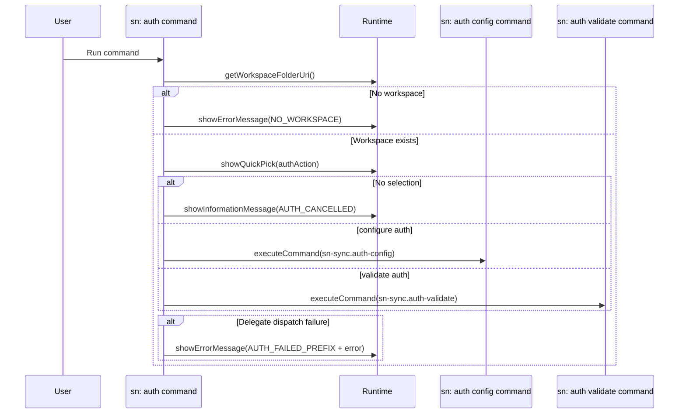

# Command: sn: auth

- Command ID: sn-sync.auth
- Entry point: src/commands/snAuthCommand.ts
- Registration: src/extension.ts

## Purpose

Provide one public auth entry point for the workspace.
It lets the user choose between configuring auth and validating the currently saved auth.

## Available actions

1. `configure auth` -> delegates to `sn-sync.auth-config`
2. `validate auth` -> delegates to `sn-sync.auth-validate`

## When to use it

- Before running pull/push/report commands.
- When credentials change.
- When switching to a different ServiceNow instance.
- When you want to confirm the currently saved auth is still valid.

## Preconditions

1. Workspace must be open.
2. VS Code quick-pick interaction must be available.

## Step-by-step logic

1. Resolve workspaceFolderUri.
2. If no workspace, return SN_SYNC_MESSAGES.NO_WORKSPACE.
3. Show a QuickPick with `configure auth` and `validate auth`.
4. If selection is dismissed, show SN_SYNC_MESSAGES.AUTH_CANCELLED.
5. If `configure auth` is selected, execute `sn-sync.auth-config`.
6. If `validate auth` is selected, execute `sn-sync.auth-validate`.
7. If delegate execution fails, show SN_SYNC_MESSAGES.AUTH_FAILED_PREFIX + normalized error.

## Cancellation policy

- Canceling the QuickPick aborts the flow.
- Delegate-specific cancellation behavior is handled inside the selected internal command.

## Side effects

- No direct auth data is written by this command.
- Side effects are delegated to the selected internal command.

## Authentication model

- This is the public auth entry point.
- `configure auth` stores exactly one explicit auth type for the active workspace instance.
- Downstream commands use the saved auth type directly.
- There is no fallback from OAuth to basic auth (or vice versa).

## Delegates

- `sn-sync.auth-config` performs the full credential/token capture flow.
- `sn-sync.auth-validate` performs connection/auth validation against ServiceNow.

## Error handling

- SN_SYNC_MESSAGES.NO_WORKSPACE when no folder is open.
- SN_SYNC_MESSAGES.AUTH_CANCELLED for user cancellation.
- SN_SYNC_MESSAGES.AUTH_FAILED_PREFIX for delegate dispatch failures.

## Direct dependencies

- SN_SYNC_COMMANDS
- SN_SYNC_MESSAGES
- snCommandRuntime helpers (getWorkspaceFolderOrShowError, showPrefixedCommandError)
- SnAuthRuntime

## Sequence diagram

## Troubleshooting

- Symptom: Command exits with "sn-sync auth cancelled"
  - Cause: The auth action picker was dismissed.
  - Resolution: Run `sn: auth` again and choose an action.

- Symptom: `configure auth` path fails
  - Cause: Credential capture, token exchange, or secret storage/config write failure.
  - Resolution: Run `sn: auth` again, choose `configure auth`, and complete the flow again.

- Symptom: Later commands still fail auth
  - Cause: Saved auth is invalid, expired, or incomplete for the selected auth type.
  - Resolution: Run `sn: auth`, choose `validate auth`, and if needed rerun `configure auth`.

- Symptom: `validate auth` path fails
  - Cause: Missing/invalid saved credentials, expired OAuth state, or ServiceNow/network connectivity issues.
  - Resolution: Run `sn: auth`, choose `validate auth`, then rerun `configure auth` if validation still fails.
