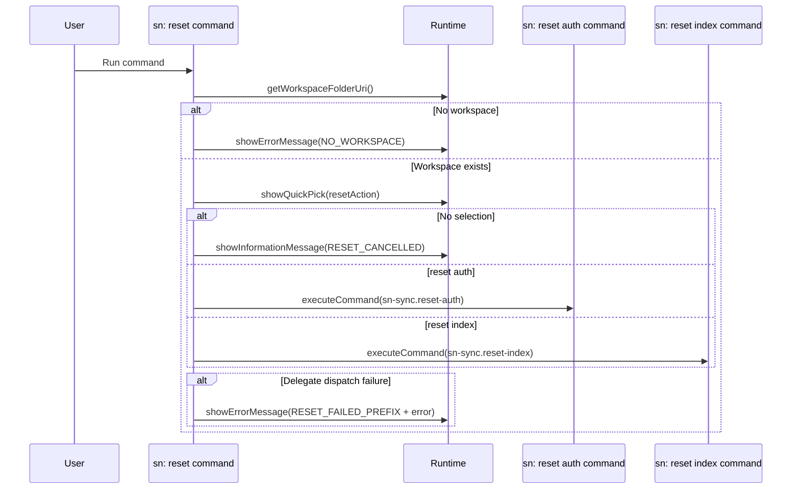

# Command: sn: reset

- Command ID: sn-sync.reset
- Entry point: src/commands/snResetCommand.ts
- Registration: src/extension.ts

## Purpose

Provide one public reset entry point for workspace maintenance actions.
It lets the user choose whether to reset auth or reset the local sync index.

## Available actions

1. `reset auth` -> delegates to `sn-sync.reset-auth`
2. `reset index` -> delegates to `sn-sync.reset-index`

## When to use it

- When you need to clear auth state.
- When you need to rebuild local sync index state.
- When troubleshooting workspace-level maintenance issues.

## Preconditions

1. Workspace must be open.
2. VS Code quick-pick interaction must be available.

## Step-by-step logic

1. Resolve workspaceFolderUri.
2. If no workspace, return SN_SYNC_MESSAGES.NO_WORKSPACE.
3. Show a QuickPick with `reset auth` and `reset index`.
4. If selection is dismissed, show SN_SYNC_MESSAGES.RESET_CANCELLED.
5. If `reset auth` is selected, execute `sn-sync.reset-auth`.
6. If `reset index` is selected, execute `sn-sync.reset-index`.
7. If delegate execution fails, show SN_SYNC_MESSAGES.RESET_FAILED_PREFIX + normalized error.

## Cancellation policy

- Canceling the QuickPick aborts the flow.
- Delegate-specific confirmation/cancellation behavior is handled inside the selected internal command.

## Side effects

- No direct reset work is performed by this command.
- Side effects are delegated to the selected internal command.

## Delegates

- `sn-sync.reset-auth` removes the active auth secret for the workspace instance.
- `sn-sync.reset-index` clears the local synchronization index.

## Error handling

- SN_SYNC_MESSAGES.NO_WORKSPACE when no folder is open.
- SN_SYNC_MESSAGES.RESET_CANCELLED for user cancellation.
- SN_SYNC_MESSAGES.RESET_FAILED_PREFIX for delegate dispatch failures.

## Direct dependencies

- SN_SYNC_COMMANDS
- SN_SYNC_MESSAGES
- snCommandRuntime helpers (getWorkspaceFolderOrShowError, showPrefixedCommandError)
- SnResetRuntime

## Sequence diagram

## Troubleshooting

- Symptom: Command exits with "sn-sync reset cancelled"
  - Cause: The reset action picker was dismissed.
  - Resolution: Run `sn: reset` again and choose an action.

- Symptom: `reset auth` path fails
  - Cause: Secret storage deletion failed.
  - Resolution: Run `sn: reset` again, choose `reset auth`, and retry.

- Symptom: `reset index` path fails
  - Cause: Index persistence/reset failed.
  - Resolution: Run `sn: reset` again, choose `reset index`, and retry.
