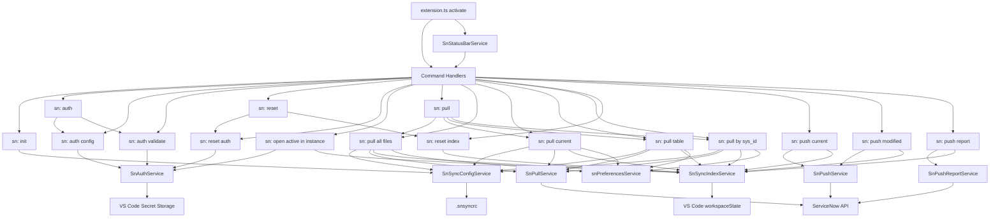

# sn-sync Architecture

## Scope

This document explains how command handlers, services, runtime abstractions, configuration, and index state fit together in sn-sync.

## High-level design

sn-sync follows a command-service split:

- Commands orchestrate user interaction, workflow branching, progress, and final user messages.
- Services encapsulate business and infrastructure logic (ServiceNow API, index persistence, config handling, hashing).
- Shared modules provide reusable primitives (constants, runtime abstraction, folder helpers, error normalization).

## Main modules

- Commands: src/commands
- Services: src/services
- Shared constants/models/services: src/shared
- Extension activation: src/extension.ts

## Activation and command registration

On activation, the extension registers all command handlers from src/extension.ts.
It also registers a status bar service that exposes quick command entry points.

Registered commands:

- sn-sync.sn-init
- sn-sync.auth
- sn-sync.auth-config
- sn-sync.auth-validate
- sn-sync.reset
- sn-sync.reset-auth
- sn-sync.run-background-script
- sn-sync.open-active-in-instance
- sn-sync.pull
- sn-sync.pull-all-files
- sn-sync.pull-current
- sn-sync.pull-table
- sn-sync.pull-by-sys-id
- sn-sync.reset-index
- sn-sync.push
- sn-sync.push-current
- sn-sync.push-report
- sn-sync.push-modified

Status bar behavior:

- Reads `sn-sync.statusBar.*` settings.
- Supports `minimal` menu mode and `expanded` direct-button mode.
- Reuses existing command IDs for execution (no duplicate command logic).
- Updates visibility based on workspace/editor context and configuration changes.

## Core data flows

### 1) Pull flow

- Input: sync settings + auth + workspace preferences
- Process: fetch records -> write files -> collect index metadata
- Output: full index snapshot replacement

### Unified pull entry flow

- Input: workspace context + user scope selection
- Process: choose `all files`, `current file`, `table`, or `by sys_id` via quick pick -> dispatch to dedicated pull flows
- Output: delegates without duplicating pull implementation logic

### Pull current flow

- Input: active editor file + indexed record metadata
- Process: resolve current file index entry -> targeted pull by table + sys_id -> incremental index update
- Output: refreshed local files for the selected record and updated index metadata

### Pull table flow

- Input: selected table from configured settings
- Process: table selection -> table-scoped pull with batched multi-field requests per query group -> incremental index update
- Output: refreshed local files for one table and updated index metadata

### 2) Push active flow

- Input: active editor file + index entry
- Process: local change check -> remote conflict check -> interactive resolve (overwrite/merge/discard/skip) -> push when applicable
- Output: one remote write + one baseline update, or local discard + baseline update

### 3) Push modified flow

- Input: all modified index candidates
- Process: full conflict pre-check -> interactive per-file resolution -> group selected files by record identity -> one PATCH per record group
- Output: batch remote writes + batch baseline updates for uploaded files + optional local discard updates

### Unified push entry flow

- Input: workspace context + user scope selection
- Process: choose `all files` or `current file` via quick pick -> dispatch to `sn-sync.push-modified` or `sn-sync.push-current`
- Output: delegates to existing push workflows without duplicating push logic

### 4) Run background script flow

- Input: script file content + authenticated instance context
- Process: resolve script source (active editor or file prompt) -> validate content -> confirm instance/user -> send to ServiceNow background script endpoint -> capture and display output
- Output: execution result + output channel log display

### 5) Push report flow

- Input: modified candidates
- Process: scope/update-set resolution
- Output: markdown report only (read-only behavior)

### 6) Open active in instance flow

- Input: active editor file + index entry + resolved instance URL
- Process: local path -> index lookup -> record URL build -> open external browser
- Output: browser navigation to the exact ServiceNow record

## Sync index model

Index data is stored in workspaceState and represented by entries containing:

- localPath
- table
- sysId
- fieldName
- baseHash
- updatedAt

Operationally:

- pull uses replacePullSnapshot for full baseline refresh
- pull-by-sys-id uses recordPullFiles for incremental index updates
- push commands use updateBaseHashes to advance baseline from the values stored remotely after successful writes
- reset-index uses clearIndex to wipe all entries

## Runtime abstraction pattern

Each command defines a runtime interface that extends the shared base runtime.

Common benefits:

- Decouples command logic from direct VS Code APIs
- Improves unit testability
- Enables deterministic testing with mocked UI and progress

Current shared runtime helpers:

- getWorkspaceFolderOrShowError: standard workspace precondition and NO_WORKSPACE message.
- withNotificationProgress: consistent notification progress UI across commands.
- runWithCommandStatus: immediate status-bar command execution feedback with per-command message and debounce.
- showPrefixedCommandError: standardized prefixed command error output.

## Error strategy

Command-level strategy:

- Early exits for missing preconditions (workspace, editor, settings, index entries)
- High-level try/catch around command business flow
- User-facing message prefixes from SN_SYNC_MESSAGES plus stable error codes
- Error normalization via showPrefixedCommandError and snErrorService
- Structured diagnostics logging to output channel `sn-sync diagnostics`
- Sensitive context redaction before diagnostics are written

Error message shape:

- `<prefix> (<ERROR_CODE>) 
`

See `docs/error-handling.md` for the current code catalog and troubleshooting flow.

Service-level strategy:

- Validate auth availability before network calls
- Validate and encode dynamic ServiceNow path segments before URL assembly
- Resolve explicit auth type from Secret Storage (`sn: auth`) without implicit fallback between methods
  - basic: build Authorization header from username/password
  - oauth: use bearer token and refresh when near expiry (when refresh token is available)
- Validate instance URL policy both at auth save time and at runtime auth resolution
  - HTTPS only
  - default host allowlist (`service-now.com`)
  - optional custom host allowlist via settings
- `validateAuth` uses resolved headers and validates against `sys_user` in ServiceNow.
- Normalize HTTP failures into actionable messages
- Keep business-specific edge handling inside services (for example report resolution notes)

Pull filesystem strategy:

- Pull destination URIs are composed with `vscode.Uri.joinPath` from workspace + configured fragments.
- `SnPullService` sanitizes generated path segments (record keys and subdir parts) for filesystem-safe filenames.
- Index metadata (`localPath`, `table`, `sysId`, `fieldName`, `baseHash`) is emitted through pull callbacks and persisted as command-level snapshots/updates.

Background script execution strategy:

- `SnBackgroundScriptService` executes scripts via the ServiceNow `/sys.scripts.do` endpoint.
- Scope resolution uses a multi-step fallback approach:
  1. Explicit scope name (user input or configuration)
  2. HTML parsing of the scripts page for available scope options
  3. API lookup via `sys_scope` table for scope identification
  4. Default to global scope when no scope options are available
- Scope matching supports exact names, canonical forms (special chars removed), and fuzzy substring matching.
- HTML parsing extracts the `ck` (cross-site request forgery token) for form submission security.
- Script output is captured from `<pre>` tags in the HTML response and displayed in the output channel.
- Common logging calls (`gs.info`, `gs.log`, `gs.warn`, `gs.error`, `gs.print`) are wrapped to ensure output visibility in VS Code.

Transport strategy:

- snHttpService provides createGotFetchTransport as the shared fetch-compatible transport.
- snHttpService also centralizes ServiceNow Table API URL construction for dynamic path segments such as table names, sys_ids, and update set ids.
- Pull/push/push-report/auth validation/background-script use that common transport path.
- This avoids behavior drift between commands and keeps timeout and response handling consistent.

Configuration security strategy:

- `.snsyncrc` is non-sensitive and stores only instance selector + sync settings.
- Auth data is persisted in Secret Storage.
- SnSyncConfigService.initialize sanitizes legacy auth fields from `.snsyncrc`.

## Key shared building blocks

- snCommandRuntime: workspace + message runtime abstraction
- snFolderService: ensureDirectoryExists and clearDirectory
- hashService: normalized text hashing
- snPreferencesService: fallback-safe preference resolution
- snHttpService: instance URL normalization, auth header helpers, ServiceNow Table API URL construction, HTTP error normalization, shared got transport
- snStringService: reusable optional-string normalization
- snPullProgressService: shared pull callback for progress and index update capture
- snSyncConstants: command IDs, messages, defaults, ServiceNow constants

## Architectural diagram

## Operational notes for developers

- The index is foundational for push safety. If index state is invalid, run `sn: reset`, choose `reset index`, then run a pull.
- Pull and push commands prioritize explicit conflict handling and safe remote writes.
- push modified resolves conflicts per file and still reduces redundant PATCH requests when multiple fields of the same record are modified.
- Command output messaging is centralized through constants to keep behavior predictable and testable.
