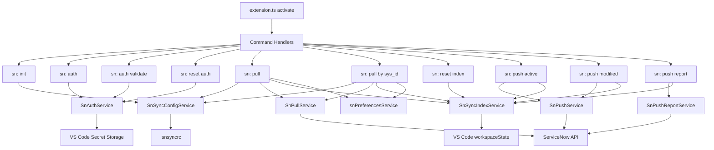

# sn-sync Architecture

## Scope

This document explains how command handlers, services, runtime abstractions, configuration, and index state fit together in sn-sync.

## High-level design

sn-sync follows a command-service split:

- Commands orchestrate user interaction, workflow branching, progress, and final user messages.
- Services encapsulate business and infrastructure logic (ServiceNow API, index persistence, config handling, hashing).
- Shared modules provide reusable primitives (constants, runtime abstraction, folder helpers, error normalization).

## Main modules

- Commands: src/commands
- Services: src/services
- Shared constants/models/services: src/shared
- Extension activation: src/extension.ts

## Activation and command registration

On activation, the extension registers all command handlers from src/extension.ts.

Registered commands:

- sn-sync.sn-init
- sn-sync.auth
- sn-sync.auth-validate
- sn-sync.reset-auth
- sn-sync.pull
- sn-sync.pull-by-sys-id
- sn-sync.reset-index
- sn-sync.push-active
- sn-sync.push-report
- sn-sync.push-modified

## Core data flows

### 1) Pull flow

- Input: sync settings + auth + workspace preferences
- Process: fetch records -> write files -> collect index metadata
- Output: full index snapshot replacement

### 2) Push active flow

- Input: active editor file + index entry
- Process: local change check -> remote conflict check -> push
- Output: one remote write + one baseline update

### 3) Push modified flow

- Input: all modified index candidates
- Process: full conflict pre-check -> batch upload
- Output: batch remote writes + batch baseline updates

### 4) Push report flow

- Input: modified candidates
- Process: scope/update-set resolution
- Output: markdown report only (read-only behavior)

## Sync index model

Index data is stored in workspaceState and represented by entries containing:

- localPath
- table
- sysId
- fieldName
- baseHash
- updatedAt

Operationally:

- pull uses replacePullSnapshot for full baseline refresh
- pull-by-sys-id uses recordPullFiles for incremental index updates
- push commands use updateBaseHashes to advance baseline from the values stored remotely after successful writes
- reset-index uses clearIndex to wipe all entries

## Runtime abstraction pattern

Each command defines a runtime interface that extends the shared base runtime.

Common benefits:

- Decouples command logic from direct VS Code APIs
- Improves unit testability
- Enables deterministic testing with mocked UI and progress

Current shared runtime helpers:

- getWorkspaceFolderOrShowError: standard workspace precondition and NO_WORKSPACE message.
- withNotificationProgress: consistent notification progress UI across commands.
- showPrefixedCommandError: standardized prefixed command error output.

## Error strategy

Command-level strategy:

- Early exits for missing preconditions (workspace, editor, settings, index entries)
- High-level try/catch around command business flow
- User-facing message prefixes from SN_SYNC_MESSAGES plus stable error codes
- Error normalization via showPrefixedCommandError and snErrorService
- Structured diagnostics logging to output channel `sn-sync diagnostics`
- Sensitive context redaction before diagnostics are written

Error message shape:

- `<prefix> (<ERROR_CODE>) 
`

See `docs/error-handling.md` for the current code catalog and troubleshooting flow.

Service-level strategy:

- Validate auth availability before network calls
- Resolve basic auth deterministically from Secret Storage (`sn: auth`)
- Normalize HTTP failures into actionable messages
- Keep business-specific edge handling inside services (for example report resolution notes)

Transport strategy:

- snHttpService provides createGotFetchTransport as the shared fetch-compatible transport.
- Pull/push/push-report/auth-validate use that common transport path.
- This avoids behavior drift between commands and keeps timeout and response handling consistent.

Configuration security strategy:

- `.snsyncrc` is non-sensitive and stores only instance selector + sync settings.
- Auth data is persisted in Secret Storage.
- SnSyncConfigService.initialize sanitizes legacy auth fields from `.snsyncrc`.

## Key shared building blocks

- snCommandRuntime: workspace + message runtime abstraction
- snFolderService: ensureDirectoryExists and clearDirectory
- hashService: normalized text hashing
- snPreferencesService: fallback-safe preference resolution
- snHttpService: instance URL normalization, auth header helpers, HTTP error normalization, shared got transport
- snStringService: reusable optional-string normalization
- snPullProgressService: shared pull callback for progress and index update capture
- snSyncConstants: command IDs, messages, defaults, ServiceNow constants

## Architectural diagram

## Operational notes for developers

- The index is foundational for push safety. If index state is invalid, run sn: reset index followed by a pull.
- Pull and push commands intentionally prioritize consistency and explicit conflict handling over maximum throughput.
- Command output messaging is centralized through constants to keep behavior predictable and testable.
