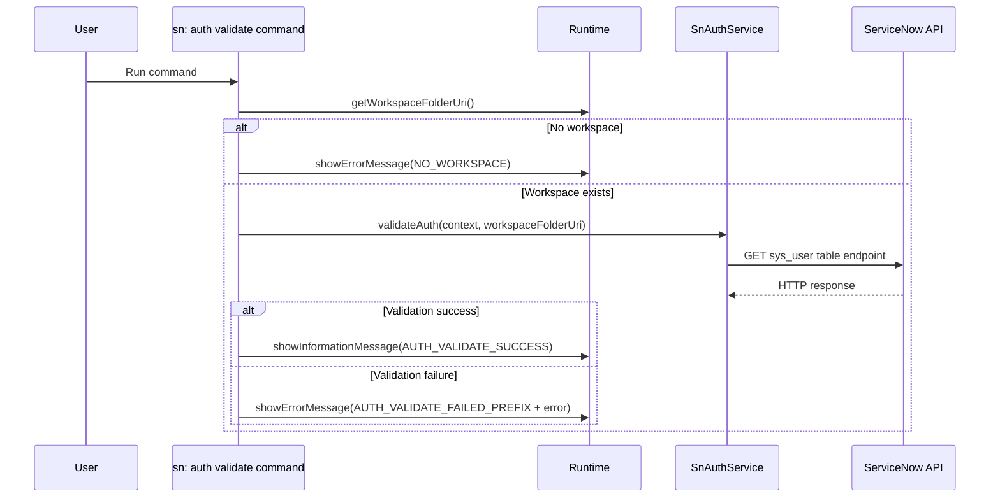

# Command: sn: auth validate

- Command ID: sn-sync.auth-validate
- Entry point: src/commands/snAuthValidateCommand.ts
- Registration: src/extension.ts

## Purpose

Validate that the currently resolved connection authentication is accepted by ServiceNow.

## When to use it

- Immediately after running sn: auth.
- When credentials may have expired or been revoked.
- As a pre-flight check before pull/push operations.

## Preconditions

1. Workspace must be open.
2. At least one auth source must be configured for this workspace/instance.
3. HTTP connectivity to ServiceNow must be available.

## Step-by-step logic

1. Resolve workspaceFolderUri.
2. If no workspace, return SN_SYNC_MESSAGES.NO_WORKSPACE.
3. Call authService.validateAuth(context, workspaceFolderUri).
4. If validation succeeds, show SN_SYNC_MESSAGES.AUTH_VALIDATE_SUCCESS.
5. If validation fails, show SN_SYNC_MESSAGES.AUTH_VALIDATE_FAILED_PREFIX + error details.

## Delegated service behavior

SnAuthService.validateAuth typically:

1. Resolves effective connection auth with this priority:
   - session headers
   - bearer
   - basic credentials saved by `sn: auth`
2. Calls a lightweight ServiceNow `sys_user` Table API request (same API family used for pull/push flows).
3. Interprets HTTP responses (including 401) and throws semantic errors.

## Side effects

- No local file modifications.
- No index changes.
- No credential updates.

## Error handling

- SN_SYNC_MESSAGES.NO_WORKSPACE.
- SN_SYNC_MESSAGES.AUTH_NOT_CONFIGURED when no auth source is available.
- SN_SYNC_MESSAGES.AUTH_VALIDATE_FAILED_PREFIX + network/HTTP/auth details.

## Direct dependencies

- SnAuthService (through SnAuthValidateServiceApi)
- SN_SYNC_MESSAGES
- snCommandRuntime helpers (getWorkspaceFolderOrShowError, showPrefixedCommandError)

## Sequence diagram

## Troubleshooting

- Symptom: "sn-sync auth is not configured"
  - Cause: No valid auth source is configured.
  - Resolution: Run `sn: auth` and verify secrets were saved correctly.

- Symptom: Invalid credentials error (401)
  - Cause: Username/password is no longer valid.
  - Resolution: Run sn: auth again and save fresh credentials.

- Symptom: HTTP/network validation failures
  - Cause: Connectivity, DNS, proxy, or instance URL problems.
  - Resolution: Verify instance URL and network path to ServiceNow.
