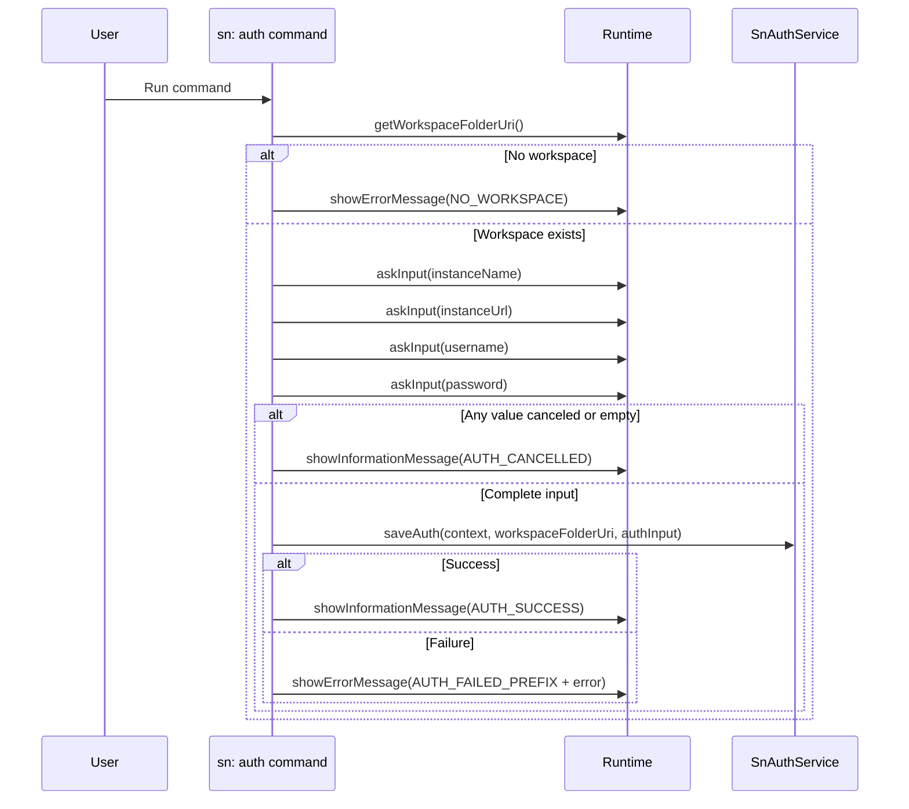

# Command: sn: auth

- Command ID: sn-sync.auth
- Entry point: src/commands/snAuthCommand.ts
- Registration: src/extension.ts

## Purpose

Capture and persist basic ServiceNow credentials for the current workspace, and set the workspace instance identity/URL used by all auth modes.

## Input fields

1. Instance name
2. Instance URL
3. Username
4. Password

## When to use it

- Before running pull/push/report commands.
- When credentials change.
- When switching to a different ServiceNow instance.

## Preconditions

1. Workspace must be open.
2. VS Code input interaction must be available.

## Step-by-step logic

1. Resolve workspaceFolderUri.
2. If no workspace, return SN_SYNC_MESSAGES.NO_WORKSPACE.
3. Execute collectAuthInput(runtime).
4. collectAuthInput prompts sequentially using askRequiredInput.
5. askRequiredInput trims values and treats empty/whitespace values as invalid.
6. If any step returns undefined, the collection returns undefined.
7. If authInput is undefined, command shows SN_SYNC_MESSAGES.AUTH_CANCELLED and exits.
8. If input is complete, call authService.saveAuth(context, workspaceFolderUri, authInput).
9. On success, show SN_SYNC_MESSAGES.AUTH_SUCCESS.
10. On failure, show SN_SYNC_MESSAGES.AUTH_FAILED_PREFIX + normalized error.

## Cancellation policy

- Canceling any InputBox aborts the full flow.
- Whitespace-only input is treated as empty.

## Side effects

- Persists `instance` in `.snsyncrc` as a non-sensitive selector.
- Stores auth data in VS Code Secret Storage (including `instanceUrl`, `username`, `password`).

## Relationship to advanced auth

- This command configures the basic-auth fallback path.
- Token/session auth must also be stored in Secret Storage.
- At runtime, advanced auth headers take precedence over basic credentials.

## Error handling

- SN_SYNC_MESSAGES.NO_WORKSPACE when no folder is open.
- SN_SYNC_MESSAGES.AUTH_CANCELLED for user cancellation/invalid input.
- SN_SYNC_MESSAGES.AUTH_FAILED_PREFIX for save failures.

## Direct dependencies

- SnAuthService
- SN_SYNC_INPUTS
- SN_SYNC_MESSAGES
- snCommandRuntime helpers (getWorkspaceFolderOrShowError, showPrefixedCommandError)
- SnAuthRuntime

## Sequence diagram

## Troubleshooting

- Symptom: Command exits with "sn-sync auth cancelled"
  - Cause: One input was canceled or blank.
  - Resolution: Rerun command and complete all fields.

- Symptom: "Failed to save sn-sync auth"
  - Cause: Secret storage/config write failure.
  - Resolution: Check VS Code workspace permissions and retry.

- Symptom: Later commands still fail auth
  - Cause: Credentials were stored but not validated.
  - Resolution: Run sn: auth validate to confirm remote acceptance.
