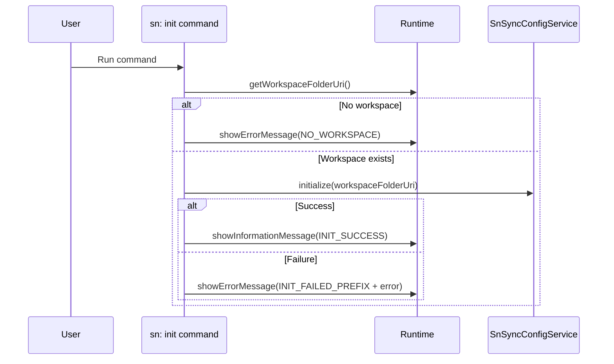

# Command: sn: init

- Command ID: sn-sync.sn-init
- Entry point: src/commands/snInitCommand.ts
- Registration: src/extension.ts

## Purpose

Initialize extension configuration in the current workspace. In practice, it guarantees that .snsyncrc exists with a valid baseline structure and default sync settings.

## When to use it

- First-time setup in a repository/workspace.
- Recreating a missing or deleted .snsyncrc file.

## When not to use it

- If you only want to validate credentials or sync scripts, use auth/pull/push commands directly.

## Preconditions

1. A workspace folder must be open in VS Code.
2. The user must have write permissions in the workspace root.

## Step-by-step logic

1. Resolve the active workspace folder from runtime.getWorkspaceFolderUri().
2. If missing, terminate with SN_SYNC_MESSAGES.NO_WORKSPACE.
3. Call configService.initialize(workspaceFolderUri).
4. On success, show SN_SYNC_MESSAGES.INIT_SUCCESS.
5. On failure, catch and show SN_SYNC_MESSAGES.INIT_FAILED_PREFIX + normalized error via getErrorMessage.

## Service behavior

The command delegates to SnSyncConfigService.initialize, which:

1. Resolves the .snsyncrc path.
2. Creates the file if it does not exist.
3. Writes default instance/settings structure when creating.

## Side effects

- May create .snsyncrc in the workspace root.
- Does not modify secrets.
- Does not modify sync index state.

## Error handling

- Functional: no workspace open.
- Operational: filesystem write/permission issues while creating config.

## Direct dependencies

- SnSyncConfigService
- defaultBaseRuntime
- getErrorMessage
- SN_SYNC_MESSAGES

## Sequence diagram

## Troubleshooting

- Symptom: "No workspace folder found"
  - Cause: VS Code window is not opened on a folder/workspace.
  - Resolution: Open the project folder and rerun the command.

- Symptom: "Failed to initialize sn-sync"
  - Cause: Write permissions or filesystem failure.
  - Resolution: Verify file permissions in workspace root and retry.
