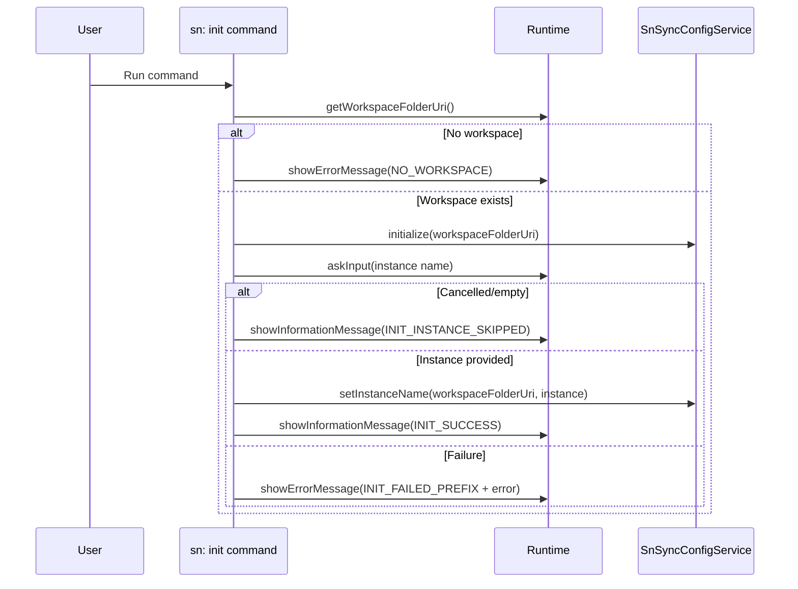

# Command: sn: init

- Command ID: sn-sync.sn-init
- Entry point: src/commands/snInitCommand.ts
- Registration: src/extension.ts

## Purpose

Initialize extension configuration in the current workspace and collect the instance name for first-time setup. In practice, it guarantees that .snsyncrc exists with a valid baseline structure and default sync settings.

## When to use it

- First-time setup in a repository/workspace.
- Recreating a missing or deleted .snsyncrc file.

## When not to use it

- If you only want to validate credentials or sync scripts, use auth/pull/push commands directly.

## Preconditions

1. A workspace folder must be open in VS Code.
2. The user must have write permissions in the workspace root.

## Step-by-step logic

1. Resolve the active workspace folder through getWorkspaceFolderOrShowError(runtime).
2. If missing, terminate with SN_SYNC_MESSAGES.NO_WORKSPACE.
3. Call configService.initialize(workspaceFolderUri).
4. Prompt for instance name via InputBox.
5. If input is empty/cancelled, complete init and show SN_SYNC_MESSAGES.INIT_INSTANCE_SKIPPED.
6. If input is valid, trim and persist to `.snsyncrc.instance` using configService.setInstanceName.
7. On success, show SN_SYNC_MESSAGES.INIT_SUCCESS.
8. On failure, catch and show SN_SYNC_MESSAGES.INIT_FAILED_PREFIX + normalized error via showPrefixedCommandError.

## Service behavior

The command delegates to SnSyncConfigService.initialize, which:

1. Resolves the .snsyncrc path.
2. Creates the file if it does not exist.
3. Writes default structure when creating:
   - `instance`: empty string
   - `settings`: default sync settings
4. Sanitizes existing `.snsyncrc` content by stripping legacy auth fields, keeping only non-sensitive configuration.

After initialization, the command stores the provided instance name (when present) through SnSyncConfigService.setInstanceName.

## Side effects

- May create .snsyncrc in the workspace root.
- May update `.snsyncrc.instance` when a non-empty instance name is provided.
- Does not modify secrets.
- Does not modify sync index state.

## Error handling

- Functional: no workspace open.
- Operational: filesystem write/permission issues while creating config.

## Direct dependencies

- SnSyncConfigService
- snCommandRuntime helpers (defaultBaseRuntime, getWorkspaceFolderOrShowError, showPrefixedCommandError)
- SN_SYNC_MESSAGES

## Sequence diagram

## Troubleshooting

- Symptom: "No workspace folder found"
  - Cause: VS Code window is not opened on a folder/workspace.
  - Resolution: Open the project folder and rerun the command.

- Symptom: "Failed to initialize sn-sync"
  - Cause: Write permissions or filesystem failure.
  - Resolution: Verify file permissions in workspace root and retry.

- Symptom: init completes without instance name
  - Cause: Instance prompt was cancelled or empty.
  - Resolution: Re-run `sn: init` or run `sn: auth` to set/select an instance.
