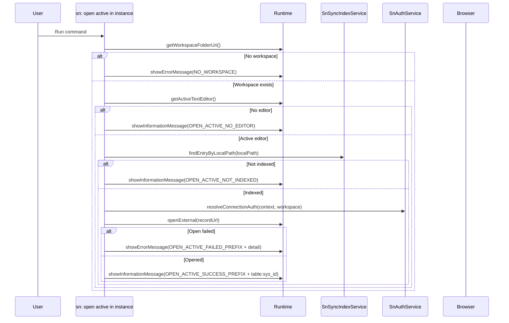

# Command: sn: open active in instance

- Command ID: sn-sync.open-active-in-instance
- Entry point: src/commands/snOpenActiveInInstanceCommand.ts
- Registration: src/extension.ts

## Purpose

Open the currently active, indexed file as its corresponding ServiceNow record in the browser.

## Default shortcut

- macOS: `cmd+alt+o`
- Windows/Linux: `ctrl+alt+o`

## When to use it

- Quickly verify the remote record after local edits.
- Jump from local file to ServiceNow form without searching by table/sys_id.

## Preconditions

1. Workspace is open.
2. Active editor exists.
3. Active file is indexed.
4. Valid instance auth/config is available.

## Step-by-step logic

1. Resolve workspaceFolderUri.
2. If missing, show SN_SYNC_MESSAGES.NO_WORKSPACE.
3. Resolve active editor.
4. If missing, show SN_SYNC_MESSAGES.OPEN_ACTIVE_NO_EDITOR.
5. Resolve workspace-relative localPath via indexService.toWorkspaceRelativePath.
6. Resolve index entry via indexService.findEntryByLocalPath.
7. If entry is missing, show SN_SYNC_MESSAGES.OPEN_ACTIVE_NOT_INDEXED.
8. Resolve connection auth via authService.resolveConnectionAuth.
9. Build record URL: `<instance>/<table>.do?sys_id=<sys_id>`.
10. Open URL with vscode.env.openExternal.
11. If openExternal returns false, fail with SN_SYNC_MESSAGES.OPEN_ACTIVE_OPEN_FAILED.
12. On success, show SN_SYNC_MESSAGES.OPEN_ACTIVE_SUCCESS_PREFIX + `table:sys_id`.
13. On any failure, show SN_SYNC_MESSAGES.OPEN_ACTIVE_FAILED_PREFIX + normalized details.

## Side effects

- Opens external browser URL.
- No local file or index mutations.

## Error handling

- SN_SYNC_MESSAGES.NO_WORKSPACE.
- SN_SYNC_MESSAGES.OPEN_ACTIVE_NO_EDITOR.
- SN_SYNC_MESSAGES.OPEN_ACTIVE_NOT_INDEXED.
- SN_SYNC_MESSAGES.OPEN_ACTIVE_FAILED_PREFIX for auth/config/openExternal failures.

## Direct dependencies

- SnAuthService
- SnSyncIndexService
- snCommandRuntime helpers (getWorkspaceFolderOrShowError, showPrefixedCommandError)

## Sequence diagram

## Troubleshooting

- Symptom: "Active file is not indexed"
  - Cause: File has no index entry.
  - Resolution: Run sn: pull or sn: pull by sys_id first.

- Symptom: Command fails with auth/config error
  - Cause: Instance/auth not configured or invalid.
  - Resolution: Run sn: auth and sn: auth validate.

- Symptom: Browser does not open
  - Cause: OS/browser integration failure.
  - Resolution: Check system default browser configuration and retry.
