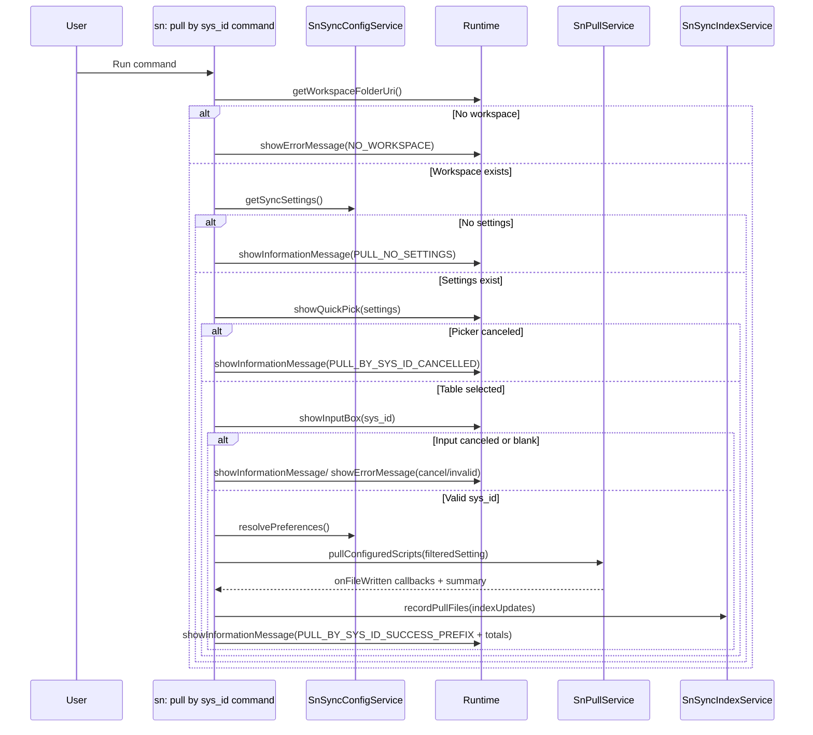

# Command: sn: pull by sys_id

- Command ID: sn-sync.pull-by-sys-id
- Entry point: src/commands/snPullBySysIdCommand.ts
- Registration: src/extension.ts

## Purpose

Execute a targeted pull for a single ServiceNow record (by sys_id), using a table selected by the user from existing sync settings.

## When to use it

- Quickly retrieve one specific record without running full pull.
- Reconcile one missing/outdated local file.

## Preconditions

1. Workspace is open.
2. Sync configuration contains at least one setting.
3. Valid ServiceNow credentials are available.

## Step-by-step logic

1. Resolve workspaceFolderUri.
2. If missing, show SN_SYNC_MESSAGES.NO_WORKSPACE.
3. Load settings with getSyncSettings.
4. If empty, show SN_SYNC_MESSAGES.PULL_NO_SETTINGS.
5. Build QuickPick items from settings:
   - label: folder
   - description: table
   - detail: original query
6. Show table picker (showQuickPick).
7. If canceled, show SN_SYNC_MESSAGES.PULL_BY_SYS_ID_CANCELLED.
8. Prompt for sys_id with showInputBox and inline non-empty validation.
9. If canceled, show SN_SYNC_MESSAGES.PULL_BY_SYS_ID_CANCELLED.
10. Trim final input.
11. If empty after trim, show SN_SYNC_MESSAGES.PULL_BY_SYS_ID_INVALID_SYS_ID.
12. Resolve preferences (rootDir) through resolvePreferences.
13. Ensure rootDir exists.
14. Build filteredSetting by cloning selected setting and forcing query to sys_id=<value>.
15. Run pullService.pullConfiguredScripts with [filteredSetting], rootDir, and onFileWritten callback.
16. onFileWritten:
    - reports Writing N files progress
    - accumulates complete metadata entries into indexUpdates
17. Persist indexUpdates with indexService.recordPullFiles.
18. Report final progress increment to 100.
19. Show success with summary metrics.
20. On any error, show SN_SYNC_MESSAGES.PULL_BY_SYS_ID_FAILED_PREFIX + details.

## Differences vs sn: pull

- Processes exactly one selected setting.
- Does not pre-clear rootDir.
- Performs partial index update (recordPullFiles), not full snapshot replacement.

## Side effects

- Writes one or more local files related to the selected record.
- Updates index entries for those written files.

## Error and cancellation model

- UI cancellations are treated as expected exits (informational message).
- Infrastructure/API/filesystem problems are surfaced as command failures.

## Direct dependencies

- SnSyncConfigService
- SnPullService
- SnSyncIndexService
- snFolderService (ensureDirectoryExists)
- snPreferencesService (resolvePreferences)
- Runtime with showQuickPick/showInputBox/withProgress

## Sequence diagram

## Troubleshooting

- Symptom: Table picker is empty
  - Cause: No valid sync settings are configured.
  - Resolution: Validate settings in .snsyncrc and rerun.

- Symptom: "A valid sys_id is required"
  - Cause: Input was blank or whitespace.
  - Resolution: Paste a real ServiceNow sys_id.

- Symptom: Pull succeeds but no indexed entries are added
  - Cause: onFileWritten metadata is incomplete.
  - Resolution: Verify pull service emits localPath/table/sysId/fieldName/baseHash.
