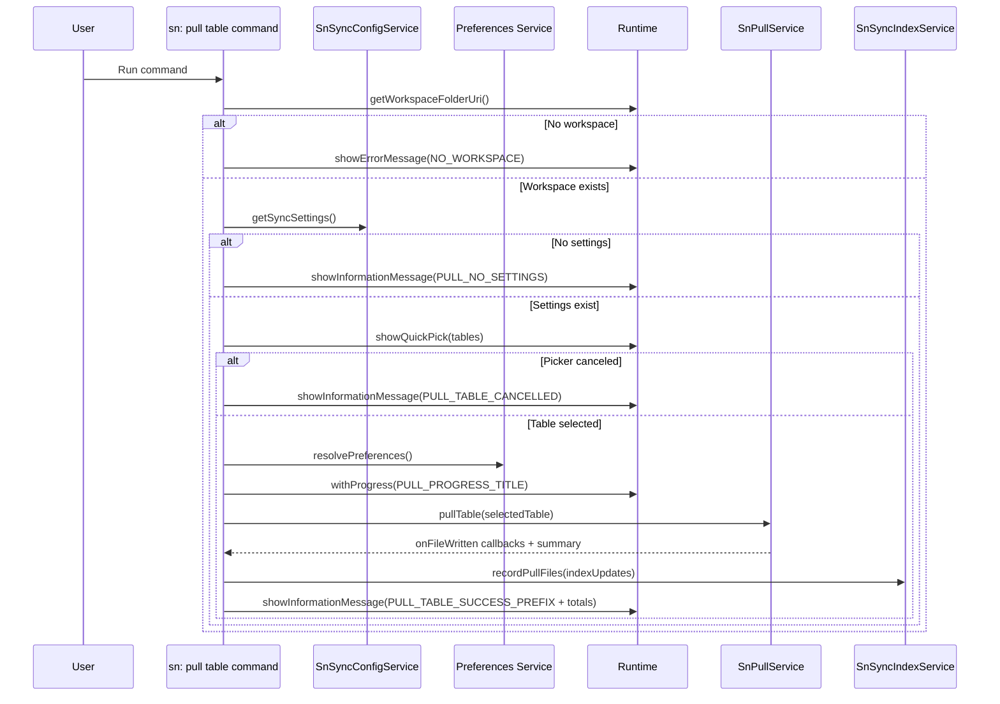

# Command: sn: pull table

- Command ID: sn-sync.pull-table
- Entry point: src/commands/snPullTableCommand.ts
- Registration: src/extension.ts

## Purpose

Pull records for one configured table only, without running a full pull.

## Primary use cases

- Refresh one table (for example `sp_widget`) after remote updates.
- Avoid full sync when working in a focused area.
- Rebuild local files and index metadata for a single table.

## Preconditions

1. Workspace is open.
2. Sync configuration contains at least one setting.
3. User selects one table from configured settings.
4. Valid connection auth is available.

## Step-by-step logic

1. Resolve `workspaceFolderUri`.
2. If missing, show `SN_SYNC_MESSAGES.NO_WORKSPACE`.
3. Load settings with `configService.getSyncSettings`.
4. If empty, show `SN_SYNC_MESSAGES.PULL_NO_SETTINGS`.
5. Build table picker from unique table names in settings.
6. Show Quick Pick with `SN_SYNC_MESSAGES.PULL_TABLE_PROMPT`.
7. If canceled, show `SN_SYNC_MESSAGES.PULL_TABLE_CANCELLED`.
8. Resolve effective preferences via `resolvePreferences`.
9. Ensure `rootDir` exists with `ensureDirectoryExists`.
10. Start progress notification with `SN_SYNC_MESSAGES.PULL_PROGRESS_TITLE`.
11. Collect pull metadata via shared `onFileWritten` callback (`createPullFileWrittenHandler`).
12. Execute table-scoped pull:

- Preferred path: `pullService.pullTable(...)`.
- Fallback path: `pullService.pullConfiguredScripts(...)` using settings filtered by selected table.

13. Persist index updates with `indexService.recordPullFiles(...)`.
14. Report progress completion.
15. Show success with `SN_SYNC_MESSAGES.PULL_TABLE_SUCCESS_PREFIX` + files/records/table.
16. On error, show `SN_SYNC_MESSAGES.PULL_TABLE_FAILED_PREFIX` + normalized details.

## Batching behavior

`SnPullService.pullTable` batches records by table and query group:

- Filters settings by selected table.
- Groups matched settings by `setting.query`.
- For each query group:
  - Builds a union of required fields across settings (`key`, `sys_id`, synced fields, subdir tokens).
  - Executes one request stream per query group (including pagination when needed).
  - Reuses each fetched record to write all matching local files for that group.

This avoids one request per synced field and keeps multi-field records efficient.

## Index behavior

This command performs incremental index updates (`recordPullFiles`) for files written during the command.

Unlike full pull (`replacePullSnapshot`), it does not clear entries outside the current table scope.

## Side effects

- Creates `rootDir` if it does not exist.
- Writes local files for selected table records.
- Updates sync index entries for written files.

## Direct dependencies

- `SnSyncConfigService`
- `SnPullService`
- `SnSyncIndexService`
- `snPreferencesService` (`resolvePreferences`)
- `snFolderService` (`ensureDirectoryExists`)
- `snPullProgressService` (`createPullFileWrittenHandler`)
- `snCommandRuntime` helpers (`getWorkspaceFolderOrShowError`, `withNotificationProgress`, `showPrefixedCommandError`)

## Sequence diagram

## Troubleshooting

- Symptom: "No sync settings found"
  - Cause: `.snsyncrc` has no valid settings array.
  - Resolution: Run `sn: init` and validate `settings` in `.snsyncrc`.

- Symptom: Table picker does not show expected table
  - Cause: Table is not present in configured settings.
  - Resolution: Add/update table settings and rerun.

- Symptom: Pull table succeeds but expected files are missing
  - Cause: Record key field was empty or query returned no matching records.
  - Resolution: Verify `key`, `query`, and table data in ServiceNow.

- Symptom: Pull table fails with invalid path segment
  - Cause: A setting contains malformed workspace path fragments or table name.
  - Resolution: Correct setting values in `.snsyncrc` and rerun.
