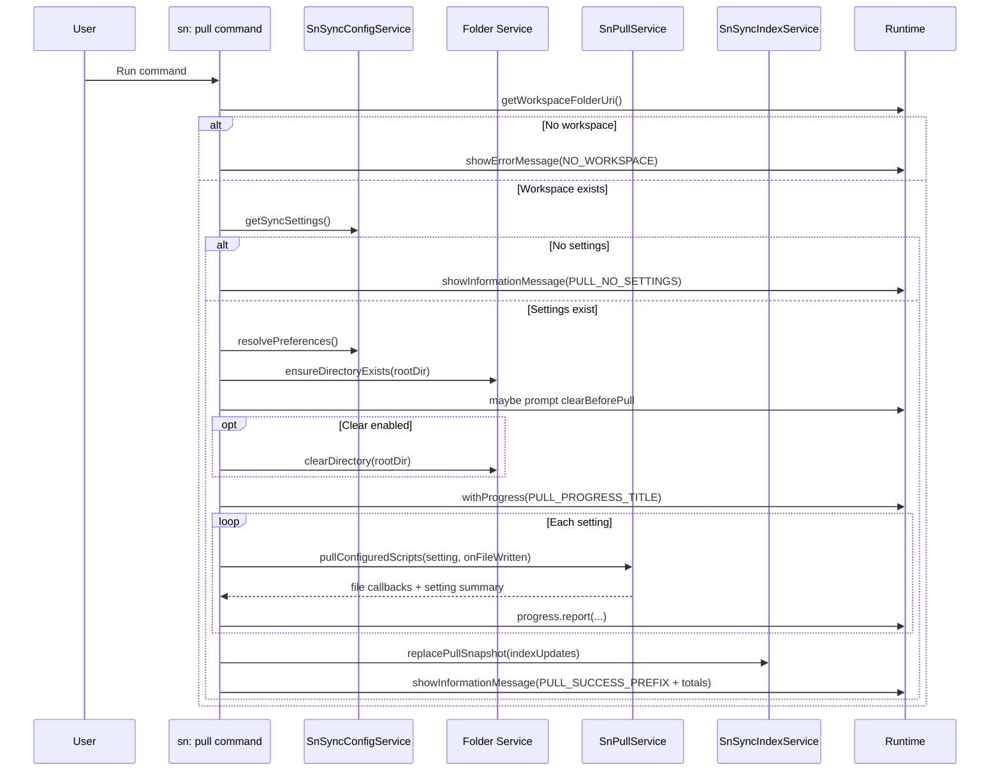

# Command: sn: pull

- Command ID: sn-sync.pull
- Entry point: src/commands/snPullCommand.ts
- Registration: src/extension.ts

## Purpose

Download configured records/scripts from ServiceNow into the local filesystem and refresh the sync index snapshot so the extension has an accurate baseline for future change detection.

## Primary use cases

- Full local synchronization from a ServiceNow instance.
- Bootstrapping a new workspace clone.
- Rebuilding local baseline after remote-side updates.

## Preconditions

1. Workspace is open.
2. Valid sync settings exist in configuration.
3. Valid credentials are stored in secret storage.

## Relevant configuration

- sn-sync.rootDir
- sn-sync.pull.clearBeforePull (ask | delete | keep)

## Step-by-step logic

1. Resolve workspaceFolderUri.
2. If missing, fail with SN_SYNC_MESSAGES.NO_WORKSPACE.
3. Load sync settings through configService.getSyncSettings.
4. If empty, show SN_SYNC_MESSAGES.PULL_NO_SETTINGS and stop.
5. Resolve effective preferences through resolvePreferences.
6. Ensure rootDir exists via ensureDirectoryExists.
7. Decide whether to clear rootDir before pull:
   - delete -> true
   - keep -> false
   - ask -> prompt user and evaluate selected action
8. If clearing is enabled, clearDirectory(rootDir).
9. Start progress notification with SN_SYNC_MESSAGES.PULL_PROGRESS_TITLE.
10. Initialize counters and indexUpdates accumulator.
11. Iterate settings sequentially and call pullService.pullConfiguredScripts for each setting.
12. In onFileWritten callback:
    - increment visible file counter
    - report progress message with folder/file
    - append complete metadata entries to indexUpdates
13. After each setting:
    - accumulate records/files
    - report progress increment by setting count
14. After loop completion, replace full index snapshot through indexService.replacePullSnapshot(workspaceFolderUri, indexUpdates).
15. Show success with file/record/setting totals.
16. On any error, show SN_SYNC_MESSAGES.PULL_FAILED_PREFIX + normalized reason.

## Index behavior details

This command uses full snapshot replacement, not incremental baseline updates.

Implications:

- Entries not returned by the current pull disappear from index state.
- Reduces stale-entry drift and false modified detections.

## Pre-pull cleanup strategy

Decision is implemented in shouldDeleteBeforePullCommand:

- clearBeforePull=ask displays prompt from SN_SYNC_MESSAGES.PULL_CLEAR_SRC_PROMPT with runtime rootDir replacement.
- Compares selected button with SN_SYNC_MESSAGES.CLEAR_SRC_CONFIRM_ACTION.

## Side effects

- Writes files under rootDir.
- May delete existing rootDir content based on preference.
- Replaces workspace sync index snapshot.

## Error handling

A single high-level try/catch captures:

- Configuration load failures.
- ServiceNow/API failures from pullService.
- Filesystem write/delete failures.
- Snapshot persistence failures.

All are surfaced as SN_SYNC_MESSAGES.PULL_FAILED_PREFIX + reason.

## Direct dependencies

- SnSyncConfigService
- SnPullService
- SnSyncIndexService
- snFolderService (clearDirectory, ensureDirectoryExists)
- snPreferencesService (resolvePreferences)
- Runtime extensions for warning/progress/filesystem

## Sequence diagram

## Troubleshooting

- Symptom: "No sync settings found"
  - Cause: .snsyncrc has no valid settings array.
  - Resolution: Run sn: init and verify settings in .snsyncrc.

- Symptom: Pull fails after choosing clear
  - Cause: Filesystem permissions or locked files in rootDir.
  - Resolution: Check permissions/locks and rerun.

- Symptom: Unexpected files are removed from index after pull
  - Cause: Snapshot replacement removes entries not returned by current pull.
  - Resolution: Confirm current pull query/settings include intended records.
