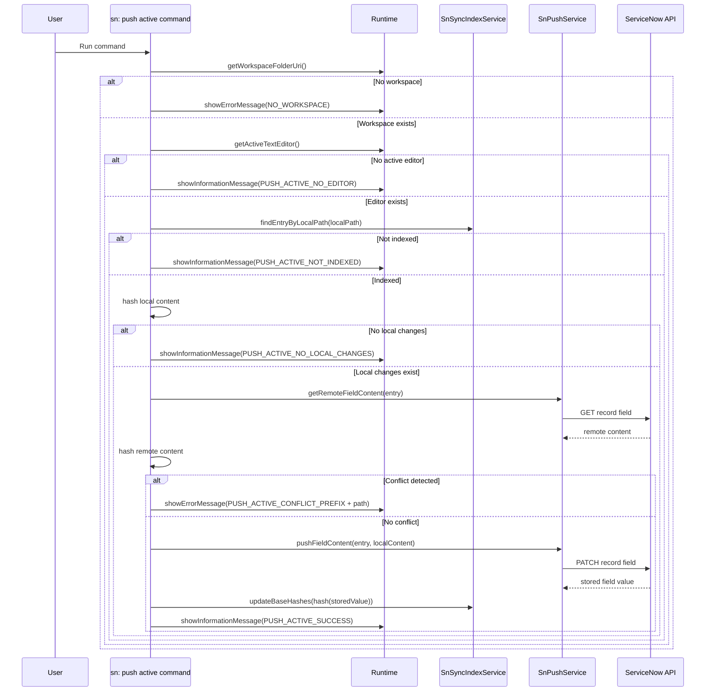

# Command: sn: push active

- Command ID: sn-sync.push-active
- Entry point: src/commands/snPushActiveCommand.ts
- Registration: src/extension.ts

## Purpose

Push exactly the currently active editor file to ServiceNow, with remote conflict verification against indexed baseline state.

## Default shortcut

- macOS: `cmd+alt+u`
- Windows/Linux: `ctrl+alt+u`

## Write safety model

The command prevents accidental overwrite by enforcing three guards:

1. File must be indexed.
2. File must contain real local changes.
3. Remote content must still match local baseline (baseHash).

Push is executed only if all three conditions are satisfied.

## Preconditions

1. Workspace is open.
2. An active text editor exists.
3. Active file is indexed from prior pull activity.
4. ServiceNow connection auth is valid.

## Step-by-step logic

1. Resolve workspaceFolderUri.
2. If missing, show SN_SYNC_MESSAGES.NO_WORKSPACE.
3. Resolve active editor.
4. If missing, show SN_SYNC_MESSAGES.PUSH_ACTIVE_NO_EDITOR.
5. Resolve workspace-relative localPath using indexService.toWorkspaceRelativePath.
6. Resolve indexed entry using findEntryByLocalPath.
7. If entry is missing, show SN_SYNC_MESSAGES.PUSH_ACTIVE_NOT_INDEXED.
8. Read active editor text and compute localHash.
9. If localHash equals entry.baseHash, show SN_SYNC_MESSAGES.PUSH_ACTIVE_NO_LOCAL_CHANGES.
10. Fetch remote field content and compute remoteHash.
11. If remoteHash differs from entry.baseHash, abort with SN_SYNC_MESSAGES.PUSH_ACTIVE_CONFLICT_PREFIX + path.
12. If no conflict, push local content via pushFieldContent.
13. Update entry baseline hash using the value returned by pushFieldContent (actual content stored in ServiceNow), then persist with indexService.updateBaseHashes.
14. Show SN_SYNC_MESSAGES.PUSH_ACTIVE_SUCCESS.
15. On any thrown error, show SN_SYNC_MESSAGES.PUSH_ACTIVE_FAILED_PREFIX + details.

## Side effects

- Remote write to one ServiceNow record field.
- Baseline hash update for one index entry.

## Request safety model

- The underlying push service validates and encodes dynamic ServiceNow path segments before issuing GET/PATCH requests.
- Malformed indexed values such as table names or `sys_id` fail fast before any network call is attempted.

## Conflict handling

Compares:

- Known local baseline (entry.baseHash)
- Current remote state (remoteHash)

If they differ, command exits without uploading.

## Direct dependencies

- SnPushService
- SnSyncIndexService
- hashText
- SN_SYNC_MESSAGES
- snCommandRuntime helpers (getWorkspaceFolderOrShowError, showPrefixedCommandError)

## Sequence diagram

## Troubleshooting

- Symptom: "Active file is not indexed"
  - Cause: File has no index entry.
  - Resolution: Run sn: pull or sn: pull by sys_id first.

- Symptom: Conflict error appears
  - Cause: Remote baseline changed since last local baseline.
  - Resolution: Pull latest remote state, merge manually, then retry.

- Symptom: Push succeeds but file still appears modified
  - Cause: Local content changed again after the push or index state is stale.
  - Resolution: Save file, rerun push if needed, or run sn: reset index + sn: pull to rebuild baseline.

- Symptom: Push fails with an invalid path segment error
  - Cause: The indexed entry contains a malformed table name or `sys_id`.
  - Resolution: Refresh the index from a valid pull, or inspect the stored sync/index data before retrying.
