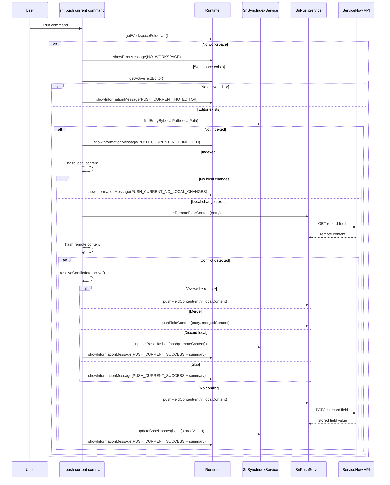

# Command: sn: push current

- Command ID: sn-sync.push-current
- Entry point: src/commands/snPushCurrentCommand.ts
- Registration: src/extension.ts

## Purpose

Push exactly the active editor file to ServiceNow with remote baseline verification and interactive conflict resolution.

## Default shortcut

- macOS: `cmd+alt+u`
- Windows/Linux: `ctrl+alt+u`

## Execution feedback

When the command starts, sn-sync shows an immediate status-bar spinner with command-specific text.
The spinner is debounced to avoid flicker on very fast executions.

## Write safety model

The command enforces these guards before remote upload:

1. File is indexed.
2. File has local changes.
3. Remote baseline is verified against indexed baseHash.

If guard 3 detects a mismatch, the command opens interactive conflict resolution.

## Preconditions

1. Workspace is open.
2. An active text editor exists.
3. Active file is indexed from prior pull activity.
4. ServiceNow connection auth is valid.

## Step-by-step logic

1. Resolve workspaceFolderUri.
2. If missing, show SN_SYNC_MESSAGES.NO_WORKSPACE.
3. Resolve active editor.
4. If missing, show SN_SYNC_MESSAGES.PUSH_CURRENT_NO_EDITOR.
5. Resolve workspace-relative localPath using indexService.toWorkspaceRelativePath.
6. Resolve indexed entry using findEntryByLocalPath.
7. If entry is missing, show SN_SYNC_MESSAGES.PUSH_CURRENT_NOT_INDEXED.
8. Read active editor text and compute localHash.
9. If localHash equals entry.baseHash, show SN_SYNC_MESSAGES.PUSH_CURRENT_NO_LOCAL_CHANGES.
10. Fetch remote field content and compute remoteHash.
11. If remoteHash differs from entry.baseHash, resolve conflict interactively:
    - Overwrite remote: push current local content.
    - Merge: open merge editor (or conflict-marker fallback), then push merged content.
    - Discard local: write remote content to local file and update baseline hash without push.
    - Skip: keep both sides unchanged and exit without push.
12. If no conflict, push local content via pushFieldContent.
13. Update baseline hash from returned stored content and persist with indexService.updateBaseHashes.
14. Show success with uploaded count and conflict summary.
15. On any thrown error, show SN_SYNC_MESSAGES.PUSH_CURRENT_FAILED_PREFIX + details.

## Side effects

- Remote write to one ServiceNow record field.
- Baseline hash update for one index entry when push succeeds.
- For discard-local decision, local file content is replaced with remote and baseline is updated without remote write.

## Request safety model

- The underlying push service validates and encodes dynamic ServiceNow path segments before issuing GET/PATCH requests.
- Malformed indexed values such as table names or `sys_id` fail fast before any network call is attempted.

## Conflict handling

Conflict detection compares:

- Known local baseline (entry.baseHash)
- Current remote state (remoteHash)

When mismatched, command offers:

- Overwrite remote
- Merge local and remote
- Discard local
- Skip file

Final message includes a conflict summary with counters.

## Direct dependencies

- SnPushService
- SnSyncIndexService
- hashText
- snPushConflictResolutionService
- SN_SYNC_MESSAGES
- snCommandRuntime helpers (runWithCommandStatus, getWorkspaceFolderOrShowError, showPrefixedCommandError)

## Sequence diagram

## Troubleshooting

- Symptom: "Active file is not indexed"
  - Cause: File has no index entry.
  - Resolution: Run sn: pull or sn: pull by sys_id first.

- Symptom: Conflict error appears
  - Cause: Remote baseline changed since last local baseline.
  - Resolution: Use one of the interactive options (overwrite, merge, discard, skip).

- Symptom: Command finishes with 0 files uploaded and conflict counters
  - Cause: You selected Skip or Discard local.
  - Resolution: Expected behavior. Re-run after editing if you still want to push.

- Symptom: Push succeeds but file still appears modified
  - Cause: Local content changed again after the push or index state is stale.
  - Resolution: Save file, rerun push if needed, or run sn: reset index + sn: pull to rebuild baseline.

- Symptom: Push fails with an invalid path segment error
  - Cause: The indexed entry contains a malformed table name or `sys_id`.
  - Resolution: Refresh the index from a valid pull, or inspect the stored sync/index data before retrying.
