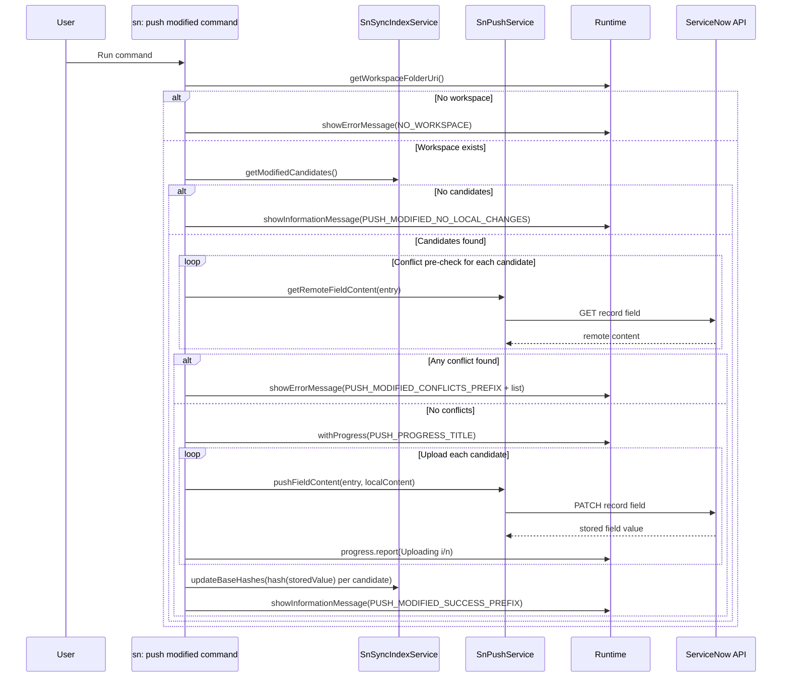

# Command: sn: push modified

- Command ID: sn-sync.push-modified
- Entry point: src/commands/snPushModifiedCommand.ts
- Registration: src/extension.ts

## Purpose

Push all locally modified indexed files as a batch, with a remote conflict pre-check for each candidate.

## High-level strategy

1. Discover modified candidates (local hash vs indexed baseHash).
2. Validate remote conflicts for every candidate.
3. If any conflict exists, abort the entire batch (all-or-nothing behavior).
4. If no conflicts exist, upload all files with progress reporting.
5. Update index baseline hashes for uploaded files.

## Preconditions

1. Workspace is open.
2. Index has been populated by previous pull operations.
3. ServiceNow connection auth is valid.

## Step-by-step logic

1. Resolve workspaceFolderUri.
2. If missing, show SN_SYNC_MESSAGES.NO_WORKSPACE.
3. Get candidates through indexService.getModifiedCandidates.
4. If none, show SN_SYNC_MESSAGES.PUSH_MODIFIED_NO_LOCAL_CHANGES.
5. Initialize conflicts array.
6. For each candidate:
   - fetch remote field content
   - hash remote content
   - compare remote hash vs candidate.entry.baseHash
   - append candidate to conflicts if mismatch
7. If conflicts array is not empty:
   - build a preview list of up to 5 file paths
   - append suffix (+N more) if needed
   - show SN_SYNC_MESSAGES.PUSH_MODIFIED_CONFLICTS_PREFIX + list
   - stop without uploading anything
8. If no conflicts:
   - run withProgress(SN_SYNC_MESSAGES.PUSH_PROGRESS_TITLE)
   - iterate candidates and call pushFieldContent for each
   - report Uploading i/n progress messages and increments
9. After uploads complete, call indexService.updateBaseHashes with hashes computed from values returned by pushFieldContent (stored ServiceNow values).
10. Show SN_SYNC_MESSAGES.PUSH_MODIFIED_SUCCESS_PREFIX + uploaded file count.
11. On failure, show SN_SYNC_MESSAGES.PUSH_MODIFIED_FAILED_PREFIX + details.

## Conflict policy

- Conservative policy: one conflict blocks the entire batch.
- Benefit: prevents partially applied remote writes.
- Trade-off: requires conflict resolution before batch push.

## Side effects

- Remote writes to multiple ServiceNow records/fields.
- Batch local index baseline updates.

## Direct dependencies

- SnPushService
- SnSyncIndexService
- hashText
- snCommandRuntime helpers (withNotificationProgress, getWorkspaceFolderOrShowError, showPrefixedCommandError)
- SN_SYNC_MESSAGES

## Sequence diagram

## Troubleshooting

- Symptom: Batch aborted with conflict list
  - Cause: At least one remote record changed from baseline.
  - Resolution: Pull, merge, and retry push.

- Symptom: No files detected for push
  - Cause: Local hashes match baseline or index is empty.
  - Resolution: Confirm edits are saved and file is indexed.

- Symptom: Upload stops mid-run with failure prefix
  - Cause: Network/API failure on one candidate.
  - Resolution: Resolve connectivity/API issue and rerun command.
