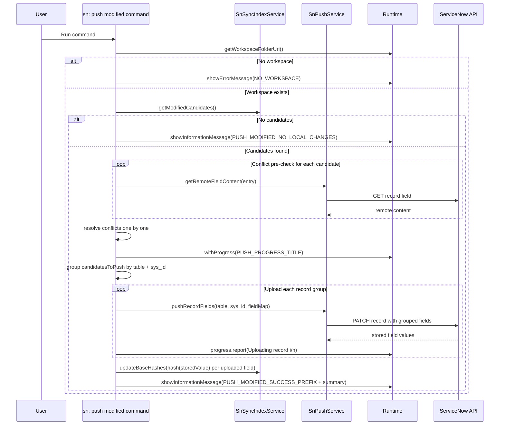

# Command: sn: push modified

- Command ID: sn-sync.push-modified
- Entry point: src/commands/snPushModifiedCommand.ts
- Registration: src/extension.ts

## Purpose

Push all locally modified indexed files as a batch, resolve conflicts per file interactively, and upload non-conflicting or resolved files grouped by record identity (table + sys_id).

## Default shortcut

- macOS: `cmd+alt+shift+u`
- Windows/Linux: `ctrl+alt+shift+u`

## High-level strategy

1. Discover modified candidates (local hash vs indexed baseHash).
2. Validate remote conflicts for every candidate.
3. Resolve each conflict with one of four actions: overwrite, merge, discard local, skip.
4. Group only files selected for upload by table + sys_id.
5. Upload one PATCH per record group with all selected fields in the JSON body.
6. Update baseline hashes using stored values returned from each grouped PATCH response.
7. Show unified summary with uploaded count and conflict counters.

## Execution feedback

When the command starts, sn-sync shows an immediate status-bar spinner with command-specific text.
The spinner is debounced to avoid flicker on very fast executions.

## Preconditions

1. Workspace is open.
2. Index has been populated by previous pull operations.
3. ServiceNow connection auth is valid.

## Step-by-step logic

1. Resolve workspaceFolderUri.
2. If missing, show SN_SYNC_MESSAGES.NO_WORKSPACE.
3. Get candidates through indexService.getModifiedCandidates.
4. If none, show SN_SYNC_MESSAGES.PUSH_MODIFIED_NO_LOCAL_CHANGES.
5. Initialize conflictCandidates and candidatesToPush arrays.
6. For each candidate:
   - fetch remote field content
   - hash remote content
   - compare remote hash vs candidate.entry.baseHash
   - append conflict candidate if mismatch, otherwise append directly to candidatesToPush
7. For each conflict candidate, resolve interactively:
   - Overwrite remote: candidate goes to candidatesToPush
   - Merge: merged content goes to candidatesToPush
   - Discard local: local file overwritten with remote content and baseline updated, no upload
   - Skip: no upload, no baseline write
8. If candidatesToPush is empty, show success with 0 uploaded plus conflict summary and return.
9. Run withProgress(SN_SYNC_MESSAGES.PUSH_PROGRESS_TITLE).
10. Group candidatesToPush by table + sys_id.
11. For each group:
    - build field map fieldName -> localContent
    - call pushRecordFields once per group (single PATCH per record)
    - map returned stored values back to each candidate field
    - report Uploading record i/n progress messages
12. After grouped uploads complete, call indexService.updateBaseHashes using returned stored values.
13. Show success with uploaded count and conflict summary.
14. On failure, show SN_SYNC_MESSAGES.PUSH_MODIFIED_FAILED_PREFIX + details.

## Conflict policy

- File-level interactive policy.
- Conflicted files do not block safe candidates.
- User explicitly chooses action for each conflict.
- Final summary reports total conflicts and chosen actions.

## Side effects

- Remote writes to multiple ServiceNow records/fields (batched by record when several modified fields share the same table + sys_id).
- Batch local baseline updates for uploaded files.
- Immediate local file/baseline update for discard-local decisions.

## Request safety model

- Each candidate request validates and encodes dynamic ServiceNow path segments before any remote GET/PATCH call.
- If one candidate carries malformed table or `sys_id` values, the command fails fast instead of sending a malformed outbound request.
- Grouped write requests preserve the same path-segment safety checks while reducing redundant PATCH traffic.

## Direct dependencies

- SnPushService
- SnSyncIndexService
- hashText
- snPushConflictResolutionService
- snCommandRuntime helpers (runWithCommandStatus, withNotificationProgress, getWorkspaceFolderOrShowError, showPrefixedCommandError)
- SN_SYNC_MESSAGES

## Sequence diagram

## Troubleshooting

- Symptom: Batch aborted with conflict list
  - Cause: Legacy runtime without interactive resolver.
  - Resolution: Update extension version/runtime.

- Symptom: Command succeeds but some conflicted files were not uploaded
  - Cause: You chose Skip or Discard local for those files.
  - Resolution: Expected behavior. Re-edit and rerun if needed.

- Symptom: No files detected for push
  - Cause: Local hashes match baseline or index is empty.
  - Resolution: Confirm edits are saved and file is indexed.

- Symptom: Upload stops mid-run with failure prefix
  - Cause: Network/API failure while uploading one grouped record PATCH.
  - Resolution: Resolve connectivity/API issue and rerun command.

- Symptom: Batch push fails with an invalid path segment error
  - Cause: At least one indexed candidate has a malformed table name or `sys_id`.
  - Resolution: Rebuild or inspect index entries with `sn: pull` / `sn: pull by sys_id` before retrying.
