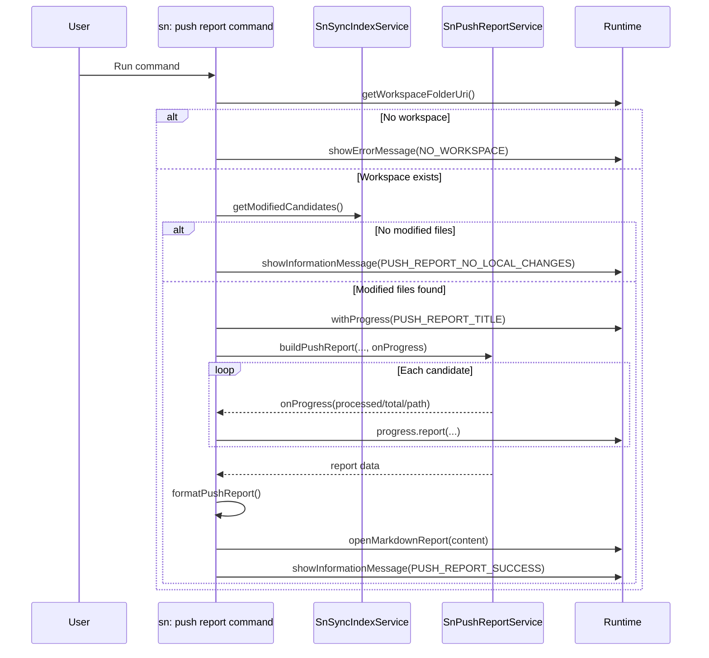

# Command: sn: push report

- Command ID: sn-sync.push-report
- Entry point: src/commands/snPushReportCommand.ts
- Registration: src/extension.ts

## Purpose

Generate a Markdown report for modified files that are candidates for push, grouped by scope and enriched with resolved update set metadata.

## Default shortcut

- macOS: `cmd+alt+r`
- Windows/Linux: `ctrl+alt+r`

## Output

Opens a temporary Markdown document in VS Code containing:

1. Modified file count summary.
2. Scope summary table.
3. Files-to-push table with:
   - File
   - Table
   - Field
   - Scope
   - Update set
   - Note

## Preconditions

1. Workspace is open.
2. Index contains entries.
3. Valid connection auth exists for report service calls.

## Step-by-step logic

1. Resolve workspaceFolderUri.
2. If missing, show SN_SYNC_MESSAGES.NO_WORKSPACE.
3. Get modified candidates via getModifiedCandidates.
4. If empty, show SN_SYNC_MESSAGES.PUSH_REPORT_NO_LOCAL_CHANGES.
5. Execute withProgress using SN_SYNC_MESSAGES.PUSH_REPORT_TITLE.
6. Emit initial progress message: Analyzing N modified files...
7. Invoke reportService.buildPushReport(context, workspace, candidates, { onProgress }).
8. Service onProgress callback reports:
   - increment: 100 / total
   - message: Resolving X/Y: localPath
9. Format final data into Markdown via formatPushReport.
10. Open markdown in editor through openMarkdownReport.
11. Show SN_SYNC_MESSAGES.PUSH_REPORT_SUCCESS.
12. On fatal failure, show SN_SYNC_MESSAGES.PUSH_REPORT_FAILED_PREFIX + details.

Fatal failure means the command cannot continue at all (for example missing workspace, missing auth, or runtime/document rendering failure). Per-record metadata failures are handled as partial results and surfaced as row notes in the report.

## Markdown formatting details

formatPushReport:

1. Builds the title block.
2. Writes summary sentence.
3. Renders scope table.
4. Renders file detail table.
5. Escapes pipe characters with escapePipes for valid Markdown tables.
6. Formats update set through formatUpdateSet:
   - no id -> SN_SYNC_MESSAGES.PUSH_REPORT_NO_UPDATE_SET
   - id without name -> id
   - name + id -> Name (id)

## Update set resolution (service-level)

The command delegates all resolution to SnPushReportService, which:

1. Processes modified candidates.
2. Resolves scope per record.
3. Resolves update set metadata by scope using service rules.
4. Adds resolution notes for partial failure paths (for example 404, permissions, validation, or other HTTP failures).
5. Validates and encodes dynamic Table API path segments before outbound requests.

## Side effects

- No content push occurs.
- No index mutation occurs.
- Creates/opens a Markdown document in editor.
- Performs read-only ServiceNow metadata calls.

## Error handling

- Missing workspace errors.
- Missing/invalid auth configuration before report execution.
- Invalid ServiceNow request path segments in candidate identifiers.
- Document open/render errors.

Best-effort behavior:

- Per-record scope/update set resolution errors do not abort the command.
- Partial failures are captured in `resolutionNote` and included in the final markdown report.
- The command still returns successfully when at least partial report data can be produced.

Only fatal errors are surfaced with SN_SYNC_MESSAGES.PUSH_REPORT_FAILED_PREFIX + reason.

## Direct dependencies

- SnSyncIndexService
- SnPushReportService
- snCommandRuntime helpers (withNotificationProgress, getWorkspaceFolderOrShowError, showPrefixedCommandError)
- Runtime with openMarkdownReport
- SN_SYNC_MESSAGES

## Sequence diagram

## Troubleshooting

- Symptom: Empty report path (no candidates)
  - Cause: No local modifications vs baseline.
  - Resolution: Confirm local edits are saved and indexed.

- Symptom: Report fails with auth/HTTP error
  - Cause: Missing/invalid credentials or command-level runtime failure.
  - Resolution: Run `sn: auth`, choose `validate auth`, verify network access, and retry.

- Symptom: Report opens with warnings in the Note column
  - Cause: Partial metadata resolution failed for one or more records/scopes (for example permissions, table availability, invalid identifiers, or transient HTTP failures).
  - Resolution: Review note text per row, fix the specific permission/config/data issue, then rerun report.

- Symptom: Report opens but update set fields are empty
  - Cause: Scope/update set resolution returned no match.
  - Resolution: Verify update set/user preference configuration in ServiceNow.

- Symptom: Report fails with an invalid path segment error
  - Cause: A candidate table/sys_id or a resolved update set id is malformed for Table API path construction.
  - Resolution: Refresh the underlying index data and verify the related ServiceNow identifiers before rerunning the report.
