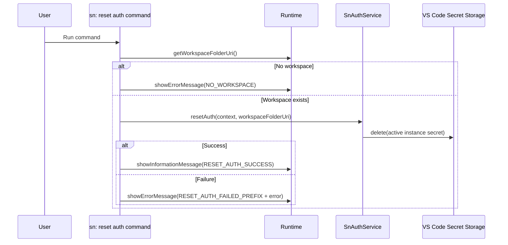

# Command: sn: reset auth

- Command ID: sn-sync.reset-auth
- Entry point: src/commands/snResetAuthCommand.ts
- Registration: src/extension.ts

## Purpose

Remove the currently active instance authentication secret from VS Code Secret Storage.

## When to use it

- You need to rotate credentials and want a clean auth state first.
- The saved auth payload is stale or invalid.
- You want to force a fresh `sn: auth` flow before future pull/push/report operations.

## Preconditions

1. Workspace must be open.
2. Extension auth service must be available.

## Step-by-step logic

1. Resolve workspaceFolderUri.
2. If missing, show SN_SYNC_MESSAGES.NO_WORKSPACE.
3. Execute authService.resetAuth(context, workspaceFolderUri).
4. On success, show SN_SYNC_MESSAGES.RESET_AUTH_SUCCESS.
5. On failure, show SN_SYNC_MESSAGES.RESET_AUTH_FAILED_PREFIX + details.

## Service behavior

SnAuthService.resetAuth:

1. Resolves the active instance name from `.snsyncrc`.
2. If no instance is configured, exits without secret deletion.
3. Computes the secret key for that instance and workspace.
4. Deletes the secret from VS Code Secret Storage.

## Side effects

- Deletes the active instance auth secret.
- Does not modify local source files.
- Does not call ServiceNow.
- Does not clear sync index state.

## Functional impact after reset

- Auth-dependent commands (pull/push/report/auth validate) will fail with auth-not-configured until `sn: auth` is run again.
- `instance` selector in `.snsyncrc` is preserved; only credentials are removed.

## Error handling

- Missing workspace.
- Secret storage deletion failures.

## Direct dependencies

- SnAuthService
- SN_SYNC_MESSAGES
- snCommandRuntime helpers (getWorkspaceFolderOrShowError, showPrefixedCommandError)

## Sequence diagram

## Troubleshooting

- Symptom: "Failed to reset sn-sync auth"
  - Cause: Secret storage operation failed.
  - Resolution: Reload VS Code window and retry.

- Symptom: Pull/push fails right after reset
  - Cause: Auth was intentionally removed.
  - Resolution: Run `sn: auth` to save fresh credentials.
