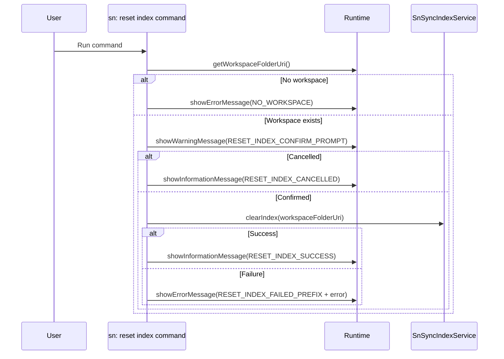

# Command: sn: reset index

- Command ID: sn-sync.reset-index
- Entry point: src/commands/snResetIndexCommand.ts
- Registration: src/extension.ts

## Purpose

Clear the local synchronization index (workspaceState) so baseline state can be rebuilt from scratch by a subsequent pull.

## When to use it

- Local index appears corrupted or inconsistent.
- After large out-of-band filesystem changes.
- Recovery step for persistent false modified-file detections.

## Preconditions

1. Workspace must be open.
2. Index service must provide clearIndex.

## Step-by-step logic

1. Resolve workspaceFolderUri.
2. If missing, show SN_SYNC_MESSAGES.NO_WORKSPACE.
3. Show warning confirmation dialog with SN_SYNC_MESSAGES.RESET_INDEX_CONFIRM_PROMPT.
4. If user dismisses or declines, show SN_SYNC_MESSAGES.RESET_INDEX_CANCELLED and stop.
5. Execute indexService.clearIndex(workspaceFolderUri).
6. On success, show SN_SYNC_MESSAGES.RESET_INDEX_SUCCESS.
7. On failure, show SN_SYNC_MESSAGES.RESET_INDEX_FAILED_PREFIX + details.

## Side effects

- Removes all index entries for the workspace.
- Does not modify local source files.
- Does not call ServiceNow.
- Requires explicit user confirmation before clearing state.

## Functional impact after reset

- Push commands that depend on index entries may not find targets until pull/pull-by-sys-id repopulates the index.
- Baseline becomes empty.

## Error handling

- Missing workspace.
- workspaceState persistence failures.

## Direct dependencies

- SnSyncIndexService
- SN_SYNC_MESSAGES
- snCommandRuntime helpers (getWorkspaceFolderOrShowError, showPrefixedCommandError)

## Sequence diagram

## Troubleshooting

- Symptom: "Failed to reset sn-sync index"
  - Cause: workspaceState update failure.
  - Resolution: Reload VS Code window and retry.

- Symptom: Push commands fail after reset
  - Cause: Index is intentionally empty.
  - Resolution: Run sn: pull all files or sn: pull by sys_id to repopulate index.

- Symptom: Nothing happened when running reset index
  - Cause: Confirmation dialog was dismissed or cancelled.
  - Resolution: Run the command again and confirm the warning prompt.
